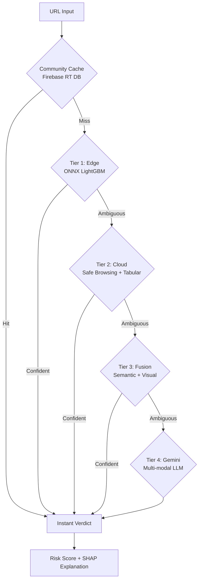

# PhishGuard

**PhishGuard** is an ultra-reliable, multi-modal phishing detection system featuring a **4-tier cascade architecture**. It provides real-time protection by orchestrating Edge, Cloud, and LLM (Gemini) intelligence to achieve >99.5% F1-score with minimal latency.

[](https://www.python.org/downloads/release/python-3110/)
[](https://opensource.org/licenses/MIT)
[](https://developers.google.com/community/solutions-challenge)

---

## Architecture: The 4-Tier Cascade

PhishGuard++ uses a hierarchical approach to balance speed and accuracy. Only the most ambiguous cases reach the heavy LLM layer.



### The Tiers
1.  **Tier 1 (Edge):** Sub-15ms URL lexical analysis using **LightGBM** quantized to **ONNX (INT8)**. Runs locally in the browser.
2.  **Tier 2 (Cloud):** Google Safe Browsing API check + high-precision Tabular analysis (XGBoost/LightGBM) on the backend.
3.  **Tier 3 (Multimodal Fusion):** Deep semantic analysis ( **PhishBERT** for URLs, **CodeBERT** for HTML) and visual branding analysis ( **EfficientNet-B7**). Outputs are fused via an **Attention-Fusion** layer.
4.  **Tier 4 (LLM/Gemini):** **Gemini 1.5 Flash** acts as the final arbiter for highly sophisticated phish, analyzing raw HTML and page screenshots.

---

## 🛠️ Tech Stack

### Frontend & Edge
- **Chrome Extension:** Manifest V3, Service Workers.
- **Inference Engine:** ONNX Runtime Web (WASM-accelerated).
- **Communication:** Async Fetch API with timeout fallbacks.

### Backend & AI
- **Framework:** FastAPI (Python 3.11) + Uvicorn.
- **Deep Learning:** PyTorch, Transformers (HuggingFace), EfficientNet.
- **Classic ML:** Scikit-learn, XGBoost, LightGBM, Optuna.
- **Explainability:** SHAP (TreeExplainer), Grad-CAM (Visual Heatmaps).
- **Data Augmentation:** CTGAN (Synthetic Data Generation), VAE (HTML Latent Features).

### Infrastructure
- **Database:** Firebase Realtime DB (Community Threat Intel).
- **LLM:** Google Gemini 1.5 Flash API.
- **Deployment:** Docker + Google Cloud Run.
- **Monitoring:** Weights & Biases (W&B).

---

## Project Structure

```text
solutions_challenge/
├── backend/             # FastAPI Cloud server and orchestration
├── extension/           # Chrome Extension (MV3, ONNX, WASM)
├── src/
│   ├── data/           # Dataset synthesis and GAN augmentation
│   ├── features/       # Dual-stream feature extraction (URL + HTML)
│   ├── models/         # Implementation of PhishBERT, CodeBERT, EfficientNet, Fusion
│   ├── explainability/ # SHAP pipelines and human-readable reasoning
│   └── evaluation/     # Adversarial benchmarks and ablation studies
├── models/              # [Artifacts] Trained .onnx, .pth, and .pkl models
├── datasets/            # [Data] Unified phishing corpus (394k+ samples)
├── papers/              # Research foundation and literature
└── requirements.txt     # Python dependency manifest
```

---

## Getting Started

### 1. Backend Setup
1.  Clone the repository and Create a virtual environment:
    ```bash
    python -m venv venv
    source venv/bin/activate  # Or `venv\Scripts\activate` on Windows
    pip install -r requirements.txt
    ```
2.  Configure `.env` with keys for `GEMINI_API_KEY`, `SAFE_BROWSING_API_KEY`, and Firebase credentials.
3.  Run the server:
    ```bash
    uvicorn backend.main:app --reload
    ```

### 2. Extension Installation
1.  Open Chrome and navigate to `chrome://extensions`.
2.  Enable **Developer mode**.
3.  Click **Load unpacked** and select the `extension/` folder.

---

## ⚖️ License
MIT License — Part of **Google Solutions Challenge 2026**.
Developed for global digital safety.
