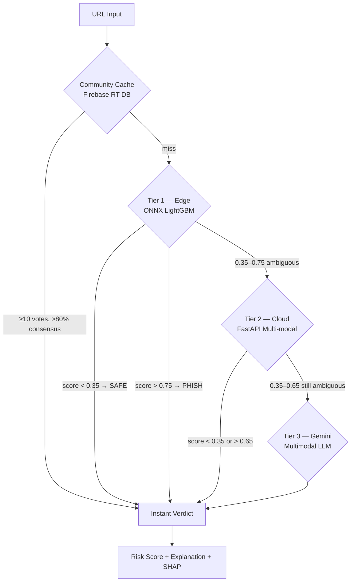

# PhishGuard++ — Implementation Plan

A multi-modal phishing detection Chrome extension with a 3-tier cascade architecture, targeting >99% F1 for the Google Solutions Challenge.

## Project Overview

Based on the existing [PhishGuard_Implementation_Plan.html](file:///c:/Users/naksh/OneDrive/Desktop/Sem%206/Capstone/solutions_challenge/PhishGuard_Implementation_Plan.html), you're building a **15-day sprint** to deliver:

| Metric | Target |
|---|---|
| F1 Score | >99% |
| Edge Latency (Tier 1) | <15ms |
| Cloud Latency (Tier 2) | <200ms |
| Gemini Latency (Tier 3) | <1500ms |
| ONNX Model Size | <300KB |
| Novel Contributions | 4 |

---

## Architecture — 3-Tier Cascade



> [!IMPORTANT]
> ~55% resolved at Tier 1, ~30% from community cache, ~10% at Tier 2, only ~5% reach Tier 3 (Gemini)

---

## Available Datasets

| Dataset | File | Size | Role |
|---|---|---|---|
| Kaggle UCI | [Kaggle_UCI.csv](file:///c:/Users/naksh/OneDrive/Desktop/Sem%206/Capstone/solutions_challenge/datasets/Kaggle_UCI.csv) | 844KB | 11k phishing samples |
| PhiUSIIL | [PhiUSIIL_Phishing_URL_Dataset.csv](file:///c:/Users/naksh/OneDrive/Desktop/Sem%206/Capstone/solutions_challenge/datasets/PhiUSIIL_Phishing_URL_Dataset.csv) | 57MB | Large URL dataset |
| PhishTank | [PhishTank.csv](file:///c:/Users/naksh/OneDrive/Desktop/Sem%206/Capstone/solutions_challenge/datasets/PhishTank.csv) | 11MB | ~10k verified phishing URLs |
| Tranco Top 1M | [Tranco_top_1m.csv](file:///c:/Users/naksh/OneDrive/Desktop/Sem%206/Capstone/solutions_challenge/datasets/Tranco_top_1m.csv) | 23MB | Legitimate URL whitelist |
| Mendeley Phishing | `Mendeley phishing dataset/` | 1000s of HTML files | 50k phish + 30k legit w/ raw HTML |

## Available Research Papers (7)

Located in `papers/` — covering deep learning for phishing detection, malicious URL detection, and MemoPhishAgent memory-augmented approaches.

---

## User Review Required

> [!WARNING]
> **Key decisions that need your input:**
> 1. **Colab vs Local Training**: DistilBERT/CodeBERT fine-tuning requires GPU (Colab T4 recommended). Do you have Colab Pro or free access?
> 2. **API Keys Needed**: Gemini API key (free tier), Google Safe Browsing API key, Firebase project setup. Do you have these?
> 3. **Weights & Biases**: The plan uses W&B for experiment tracking. Do you want this, or prefer simpler CSV/matplotlib logging?
> 4. **Chrome Web Store**: Will you publish the extension or just demo side-loaded?
> 5. **Scope for 15 Days**: The HTML plan is very ambitious. Would you like me to prioritize a **core MVP** first (Tiers 1+2 + Chrome extension), then add Tier 3 + community layer?

---

## Proposed Changes — 5 Phases

### Phase 1: Foundation & Data Engineering (Days 1–3)

#### [NEW] `src/data/dataset_builder.py`
- Merge all 5 datasets into unified corpus (>100k balanced samples)
- Dedup by URL, label normalization (phishing=1, legit=0)
- Train/val/test split (80/10/10) with stratification

#### [NEW] `src/features/url_features.py`
- Extract 20 URL lexical features: `url_length`, `domain_length`, `n_subdomains`, `digit_ratio`, `special_char_count`, `entropy_domain`, `has_ip_as_domain`, `suspicious_keyword_count`, `tld_in_subdomain`, `brand_in_path`, `punycode_detected`, `redirect_count`, `https_present`, `url_depth`, `longest_path_token`, `avg_path_token_len`, `query_digit_count`, `dot_count`, `slash_count`, `ampersand_count`

#### [NEW] `src/features/html_features.py`
- Extract 20 HTML structural features: `form_action_external`, `iframe_count`, `hidden_input_count`, `external_link_ratio`, `script_count`, `meta_refresh_present`, `login_form_present`, `password_field_count`, `title_domain_mismatch`, `favicon_external`, `anchor_to_javascript`, `copyright_year_present`, `social_media_links_count`, `page_size_bytes`, `whitespace_ratio`, `noscript_count`, `internal_link_count`, `image_count`, `ad_network_links`, `contact_page_link`

#### [NEW] `src/data/gan_augmentation.py`
- CTGAN (SDV library) — generate 20k synthetic phishing samples
- Statistical similarity validation

#### [NEW] `src/models/vae_html.py`
- VAE for latent HTML feature extraction (32-dim representation)

#### [NEW] `src/models/baseline_race.py`
- RF vs XGBoost vs LightGBM comparison, Optuna hyperparameter sweep
- Target: ≥98.5% F1 for Stage 1 model

---

### Phase 2: Core ML Pipeline (Days 4–7)

#### [NEW] `src/models/onnx_export.py`
- Export LightGBM → ONNX via `onnxmltools`
- INT8 quantization (<300KB target)

#### [NEW] `extension/` (Chrome MV3 Extension)
- `manifest.json` — MV3 service worker, permissions
- `background.js` — ONNX Runtime Web inference + cascade orchestration
- `content.js` — URL/HTML extraction from active tab
- `popup.html/js/css` — Risk gauge UI, SHAP explanations, community vote

#### [NEW] `backend/main.py` (FastAPI)
- `POST /analyze/url` — Stage 2 (XGBoost + Safe Browsing API)
- `POST /analyze/multimodal` — Stage 3 (Gemini)
- `POST /feedback` — Community votes
- SHAP explanations on every Stage 2 call

#### [NEW] `src/models/phishbert.py`
- Fine-tune DistilBERT on URL character sequences
- 3 epochs, lr=2e-5, AdamW (Colab T4, ~2hrs)

#### [NEW] `src/models/codebert_html.py`
- Fine-tune CodeBERT on HTML source (smart excerpt: head + forms + links)

#### [NEW] `src/models/attention_fusion.py`
- 2-layer MLP with softmax attention head
- Fuses 4 branch probability scores (XGBoost, PhishBERT, CodeBERT, EfficientNet)

---

### Phase 3: Multi-Modal & Visual Intelligence (Days 8–10)

#### [NEW] `backend/gemini_pipeline.py`
- Gemini 1.5 Flash integration with structured JSON output
- Brand identification + domain verification
- Screenshot + HTML excerpt input

#### [NEW] `extension/screenshot.js`
- `chrome.tabs.captureVisibleTab()` at 60% JPEG quality
- Crop to top 800px, base64 conversion

#### [NEW] `src/models/efficientnet_visual.py`
- EfficientNet-B7 transfer learning on Mendeley screenshot dataset
- Grad-CAM for visual explanations

#### [NEW] `src/explainability/shap_pipeline.py`
- TreeExplainer for Stage 2
- Map feature names → human-readable sentences

#### [NEW] `src/evaluation/adversarial_testset.py`
- 200 adversarial URLs: homoglyphs, URL padding, punycode, brand-in-subpath

---

### Phase 4: Community Layer & Deployment (Days 11–13)

#### [NEW] `backend/firebase_community.py`
- Firebase Realtime DB: `domains/{base64(domain)}` → vote counts
- Trust threshold: ≥10 votes AND >80% consensus

#### [MODIFY] `extension/background.js`
- Wire 4-tier cascade: community → ONNX → FastAPI → Gemini
- Async with timeout fallbacks at each stage

#### [NEW] `Dockerfile` + `cloudbuild.yaml`
- Containerize FastAPI backend
- Deploy to Google Cloud Run (free tier)

#### [NEW] `backend/email_detector.py`
- Gemini-powered email phishing analysis (replaces Naive Bayes)

#### [MODIFY] `extension/popup.html`
- Circular risk gauge, tier badge, report button, color-coded shield icon

---

### Phase 5: Evaluation, Demo & Submission (Days 14–15)

#### [NEW] `src/evaluation/ablation_study.py`
- 8 configuration ablation on 5k held-out test set
- Metrics: Accuracy, Precision, Recall, F1, FPR, latency

#### [NEW] `src/evaluation/benchmark.py`
- Latency profiling (100 requests per tier)
- False positive rate on top-20 legitimate sites
- Adversarial test set evaluation

#### Deliverables
- 3-minute demo video for Google Solutions Challenge
- Capstone report (5 sections: Intro, Related Work, Methodology, Experiments, Conclusion)
- W&B experiment dashboard

---

## Project Structure (Proposed)

```
solutions_challenge/
├── datasets/                    # Existing datasets
├── papers/                      # Research papers
├── src/
│   ├── data/
│   │   ├── dataset_builder.py   # Merge & clean datasets
│   │   └── gan_augmentation.py  # CTGAN synthetic data
│   ├── features/
│   │   ├── url_features.py      # 20 URL lexical features
│   │   └── html_features.py     # 20 HTML structural features
│   ├── models/
│   │   ├── baseline_race.py     # RF/XGB/LightGBM comparison
│   │   ├── vae_html.py          # VAE latent features
│   │   ├── onnx_export.py       # LightGBM → ONNX
│   │   ├── phishbert.py         # DistilBERT fine-tuning
│   │   ├── codebert_html.py     # CodeBERT fine-tuning
│   │   ├── efficientnet_visual.py
│   │   └── attention_fusion.py  # Meta-classifier
│   ├── explainability/
│   │   └── shap_pipeline.py
│   └── evaluation/
│       ├── ablation_study.py
│       ├── benchmark.py
│       └── adversarial_testset.py
├── backend/
│   ├── main.py                  # FastAPI app
│   ├── gemini_pipeline.py
│   ├── firebase_community.py
│   ├── email_detector.py
│   └── Dockerfile
├── extension/
│   ├── manifest.json
│   ├── background.js
│   ├── content.js
│   ├── screenshot.js
│   ├── popup.html
│   ├── popup.js
│   └── popup.css
├── models/                      # Trained model artifacts (.onnx, .pkl)
├── notebooks/                   # Colab training notebooks
│   ├── 01_data_exploration.ipynb
│   ├── 02_feature_engineering.ipynb
│   ├── 03_baseline_models.ipynb
│   ├── 04_phishbert_training.ipynb
│   └── 05_efficientnet_training.ipynb
├── requirements.txt
└── README.md
```

---

## Tech Stack Summary

| Layer | Technology |
|---|---|
| Browser Extension | Chrome MV3 + ONNX Runtime Web (WASM) |
| Edge ML (Tier 1) | LightGBM → ONNX INT8 quantized |
| Backend (Tier 2) | FastAPI + Python 3.11 |
| Tabular ML | XGBoost + LightGBM + SHAP |
| Semantic ML | DistilBERT ("PhishBERT") + CodeBERT |
| Visual ML | EfficientNet-B7 + Grad-CAM |
| LLM (Tier 3) | Gemini 1.5 Flash API |
| Data Augmentation | CTGAN (SDV) + VAE |
| Community Layer | Firebase Realtime DB |
| Deployment | Google Cloud Run + Docker |
| Experiment Tracking | Weights & Biases |
| Blacklist | Google Safe Browsing API |

---

## Verification Plan

### Automated Tests
- **Unit tests** for feature extraction: `pytest src/features/test_*.py`
  - Validate all 40 features compute correctly on known phishing/legit URL samples
- **Model quality gates**: `python src/evaluation/ablation_study.py`
  - Each stage must exceed minimum F1 thresholds (Stage 1: ≥98.5%, Full cascade: ≥99.5%)
- **API integration test**: `pytest backend/test_main.py`
  - Test all 3 FastAPI endpoints with mock data

### Manual Verification
1. **Chrome Extension Test**: Side-load extension in Chrome → visit `caniphish.com` → verify popup shows risk score, SHAP explanations, and correct tier badge
2. **End-to-End Cascade**: Visit known phishing URL → confirm Tier 1 catches it (<15ms). Visit ambiguous URL → confirm escalation to Tier 2/3
3. **Community Layer**: Click "Report" on popup → verify Firebase DB updates → reload same URL → confirm community cache hit
4. **Adversarial URLs**: Test homoglyph URLs (e.g., `paypa1.com`) → verify visual branch catches them even when URL features fail

> [!NOTE]
> The Mendeley phishing dataset has **thousands of raw HTML files** already available — these feed directly into HTML feature extraction and CodeBERT fine-tuning without needing web scraping.
